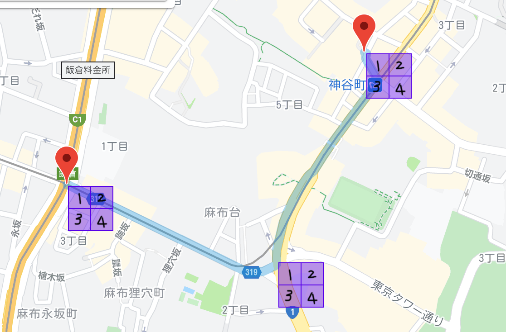
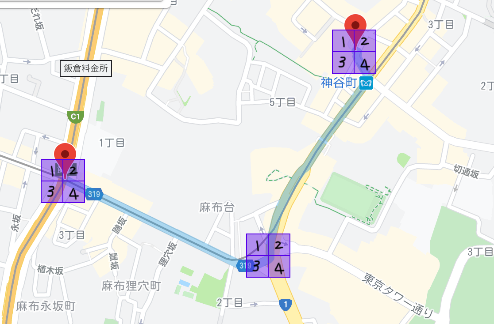
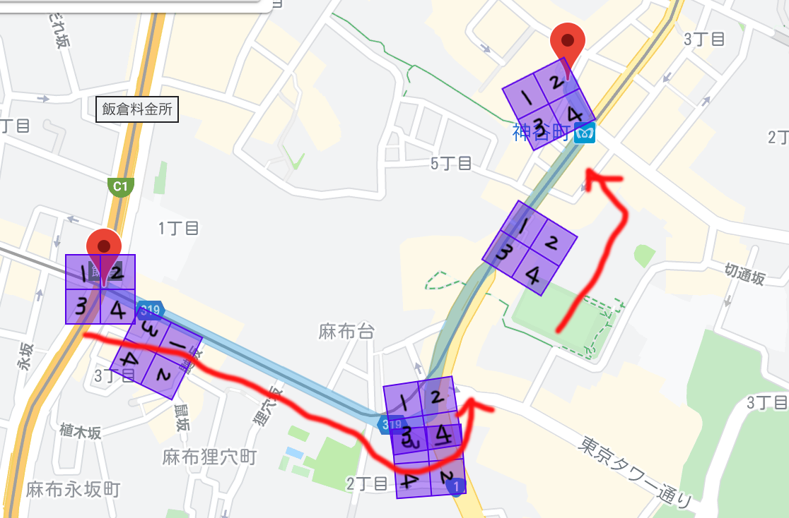
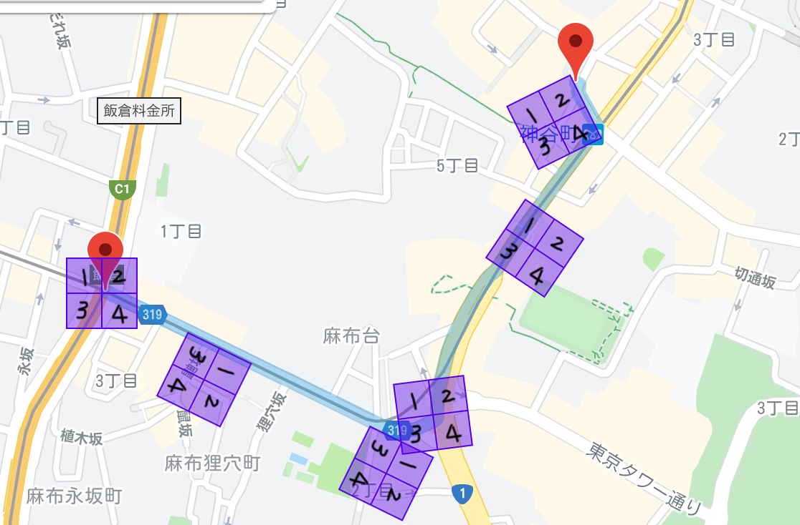
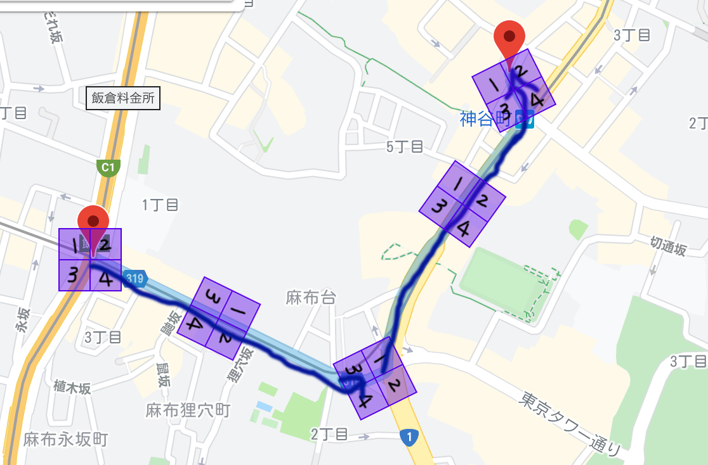

仕事で[google-map-react](https://github.com/google-map-react/google-map-react)を使ったんだけど、なかなかマーカーを回転する方法にたどり着けなかったので、その時のメモ。具体的には、車を進行方向に向けて地図上で動かしたいというもの。

## 段階的な考え方

1. GoogleMap で From to の緯度経度を取得したら方向がわかるので、計算して持っておく
1. GoogleMapReact でマーカー表示用コンポーネントに計算した向きを渡す
1. 向きの表示は **CSS** でやる

## google-map-react とは

GoogleMap を React で扱うときに、膨大な GoogleMap の API をラップして使いやすくしようよ！というライブラリ。
もちろん GoogleMapAPI も内部から使えます。

README.md から少し拝借するとこんな感じのもの。
（基本的なものは深くやりません）

```JavaScript
...

const handleApiLoaded = (map, maps) => {
  // use map and maps objects
};

...

<GoogleMapReact
  bootstrapURLKeys={{ key: /* YOUR KEY HERE */ }}
  defaultCenter={this.props.center}
  defaultZoom={this.props.zoom}
  yesIWantToUseGoogleMapApiInternals
  onGoogleApiLoaded={({ map, maps }) => handleApiLoaded(map, maps)}
>
  <AnyReactComponent
    lat={59.955413}
    lng={30.337844}
    text="My Marker"
  />
</GoogleMapReact>

```

## 今回はすでに素材はある状態です

すでに現在の緯度経度、向きを取得出来ている状態で、じゃあそれをどう表示するのが手っ取り早いのかという話です。

React のライブラリ側（上記で言うと AnyReactComponent）に放り投げれば、（他に記述なしで）反映できるんじゃないの？とか思っていたけど違いました。
そのあと、GoogleMapApi の API 使って回転するとかなのかなと思っていたけど、それは角度を取得することであって、回転済みの画像を取得するとかは意味が違いました。デフォルトの 赤い ▲ とかは出来るみたいだけど、今回は用意したアイコンを使いたいのでそれも違った。

## CSS で向きを与えるのが正解

記述量がとても少なく済むやりかたはこれだと思う。

```JavaScript{16-17}:title=AnyReactComponent
import { FunctionComponent } from 'react';
import React from 'react';

export interface MarkerProps {
  lat: number;
  lng: number;
  heading: number | null;
}

// eslint-disable-next-line @typescript-eslint/no-unused-vars
const AnyReactComponent: FunctionComponent<MarkerProps> = (props) => {
  const { heading } = props;

  return (
    <div style={{
      transformOrigin: 'left top',
      transform: 'rotate('+ heading +'deg) translate(-50px, -50px)'
    }}>
      
    </div>
  );
};

export default AnyReactComponent;
```

これで思った通りの動作ができました。
やったことは、heading(角度)を props に追加して、transform 使っただけです。

## ここから以下は GoogleMapReact の緯度経度の軌跡のテストです

### マーカーの用意

透明化した以下のようなアイコンを準備しました。(100px\*100px)


### マーカーの移動

- マーカーの位置指定なしで動かした場合。マーカーの左上が支点になっているのがわかる。



- マーカーの中心を移動軌跡に合わせたい場合は、画像ファイルの中心に位置を指定するといい。

```JavaScript:title=AnyReactComponentの該当箇所
    <div style={{
      transform: 'translate(-50px, -50px)'
    }}>
```



### マーカーの移動に回転を追加

- 回転のみを追加してみた。なんだかどんどんずれていっているんだけど・・

```JavaScript:title=AnyReactComponentの該当箇所
    <div style={{
      transform: 'rotate('+ heading +'deg) translate(-50px, -50px)'
    }}>
```



- 回転中心がわからないのかな？というわけで、デフォルトであり、上で指定した画像の中央位置を指定してみた。
  ずーれーてーるー！！ぴえん。

```JavaScript:title=AnyReactComponentの該当箇所
    <div style={{
      transformOrigin: 'center',
      transform: 'rotate('+ heading +'deg) translate(-50px, -50px)'
    }}>
```



- アンカーの位置が間違ってると思うので、それでは本来 GoogleMap の支点になっているマーカーの左上位置を transform-origin にしてみた。普通に見えるようになりました。やったね！！

```JavaScript:title=AnyReactComponentの該当箇所
    <div style={{
      transformOrigin: 'left top',
      transform: 'rotate('+ heading +'deg) translate(-50px, -50px)'
    }}>
```



この後いろいろ試したら、marker アイコンの上部位置ならどこでも思った通りの回転をするようでした。
要するに、

- transformOrigin: 'left top'
- transformOrigin: 'center top'
- transformOrigin: 'right top'

これらのどれでも普通に動くように見えました。
ちなみにここで使用したものは offset-keyword なので、X 軸 Y 軸どっちを先に書いても大丈夫なやつです。%とか px を使う場合は記述順は固定なので注意。

## 今回困ったこと

Pin と marker の名前が、ネット上で探すとごっちゃになってるので、検索がいつもの倍かかった感じ。

あとは、google-map-react の Issue やら各掲示板を見ていたときに、スプライト使わないと出来ないとか、Symbol 使えとか、いろいろ惑わされた。

## 参考

- [GoogleMap API 向きの計算](https://developers.google.com/maps/documentation/javascript/reference/geometry#spherical.computeHeading)
- [transform-origin](https://developer.mozilla.org/ja/docs/Web/CSS/transform-origin)
