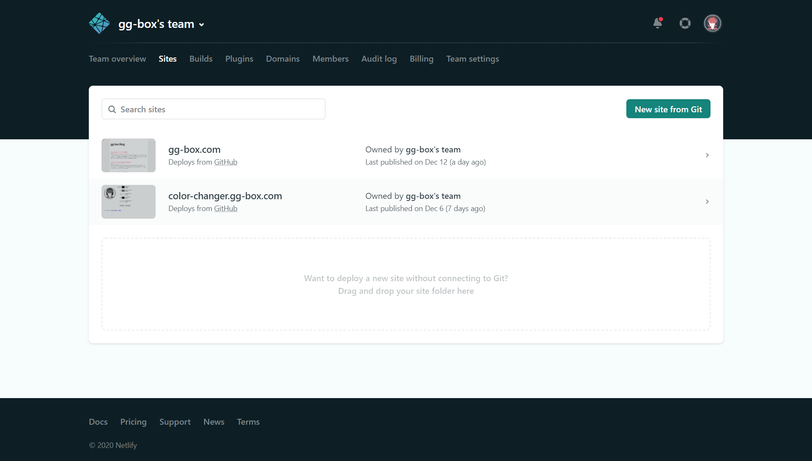
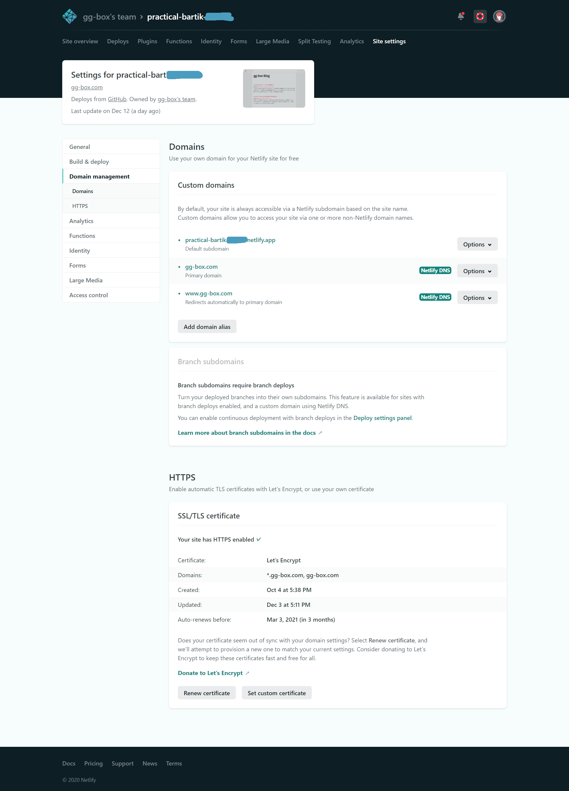
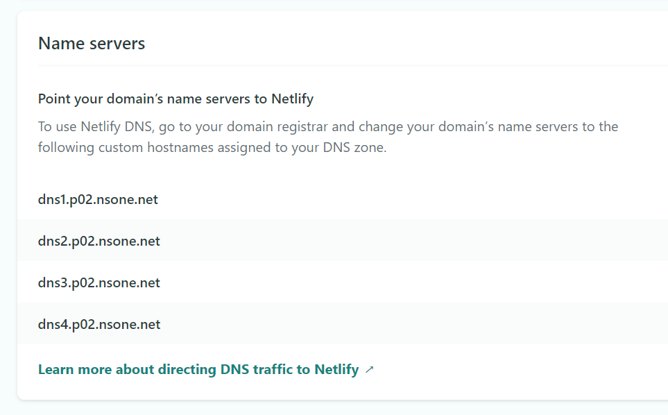
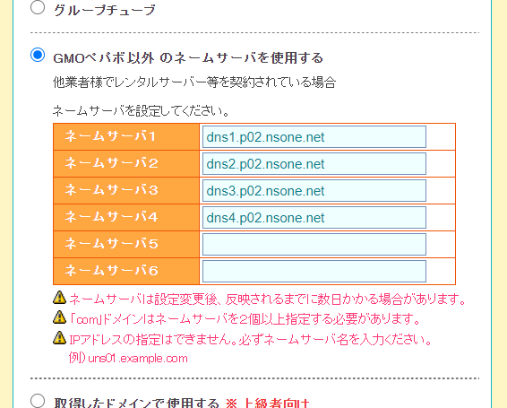

Gatsby.js は、自動ビルドしてくれるホスティングサービスの Netlify を使うと、
Git に push したタイミングでサイト公開までしてくれます。

今回は、ムームードメインで取得済みの独自ドメインを Netlify に設定します。

運用前の注意点としては、ムームードメインをロリポップなどで運用していた場合、
ロリポップに置いてあるコンテンツは見に行かなくなります。（サブドメイン含む）
既に使っているサイトがある場合は、新しいドメインを取得したほうがいいかも。

今回は、経過をキャプ取ってなかったので、結果の画面のみです。

## 前準備

- ムームードメインで独自ドメインを取得
- Netlify にアカウントを作成
- GitHub リポジトリに Gatsby.js のプロジェクトを push しておく

## 設定後にどうなるか

ここでは、メインの Gatsby.js に加え、サブドメインで別のアプリを運用しています。
サブドメインの上限

### Netlify に Git リポジトリを登録

まっさらな状態から登録するなら、[こちら](https://0forest.com/gatsby-netlify/)が画面キャプチャーも多くてとても親切。

### Netlify の公開ドメインを独自ドメインに設定

Netlify に独自ドメインを設定します。

Settings の Domain から、Custom Domain メニューのドメインを追加します。
Netlify 側が www サブドメインを強く推奨されているので、最初から www は追加しています。

### Let’s Encrypt の証明書を取得

カスタムドメインを設定したら HTTPS の Verify DNS configuration→Let's Encypt certificate をクリック。しばらくすると証明書を取得できます。

### https を強制

Force HTTPS をクリックして http でのアクセスを https にリダイレクトさせるようにします。

### Netlify のドメインの記載場所

閉じちゃってわからなくなった場合は、
Site settings → ドメイン名の右側にあるプダウン：Goto DNS Panel → Name servers にあります。

## ムームードメイン側の設定

## 後始末

ここまでの操作で独自ドメインは、Netlify 運用に切り替えられました。
今まで使っていたホスティングサービスは契約終了しましょう。
ここを忘れると、あとでかなりかなりがっかりします。

## 参考

[Netlify で独自ドメインを設定する](https://www.ravness.com/posts/netlifydomain)
[Gatsby と Netlify で簡単にブログを作成](https://qiita.com/k-penguin-sato/items/7554e5e7e90aa10ae225)
[Netlify を使って、Gatsby.js ブログを独自ドメインで公開する手順](https://0forest.com/gatsby-netlify/)
