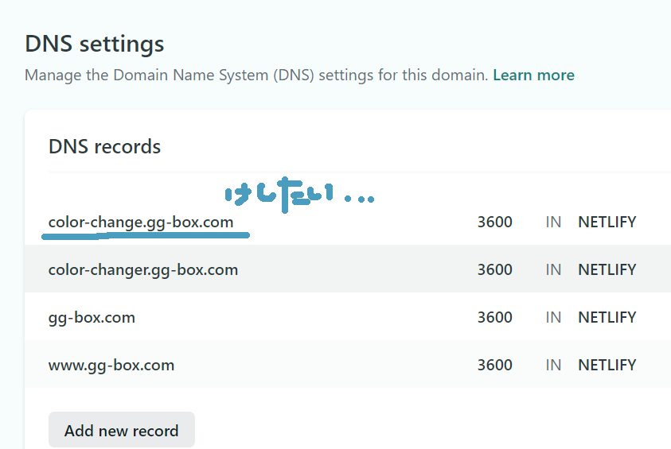

せっかくとったドメインなので、サブドメイン増殖させて使いまくろう！というのが趣旨。
Netlify にサブドメインを設定していきます。

## 前準備

- Netlify で独自ドメインを運用中
- DNS 設定もできている

## サブドメイン追加

Netlify にログインして、

- サブドメインにデプロイしたいリポジトリを Netlify でサイトに追加する
- Netlify でそのサイトの Custom domains にサブドメインつきのアドレスを指定する（sample.dskd.jp）

## 大事；サブドメイン名は間違えたら修正ができない

絶対できないわけではないが、サポートに依頼しないとできないので、無料ユーザが修正するのは、現時点ほぼ無理。
（Netlify のフロントから削除ができない）

なので、名前はちゃんと事前に考えてから登録しましょう。

## 参考

- [カスタムドメインのサブドメインに Netlify でデプロイする](https://dskd.jp/archives/103.html)
