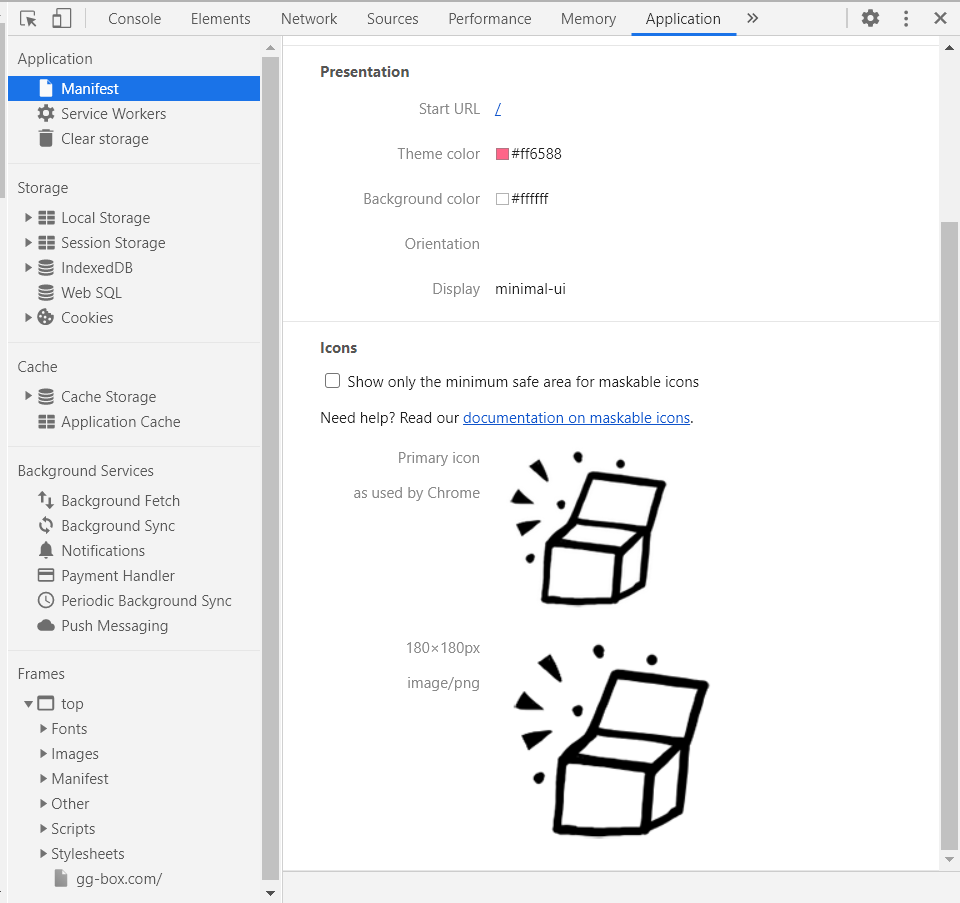

gatsby-plugin-manifest に icons を追加して、iPhone の「ホーム画面に追加」に対応します。

単に iPhone の「ホーム画面に追加」するだけなら

- gatsby-plugin-manifest に設定する方法
- react-helmet で`<header></header>`に設定する方法（単に HTML で出す）

の二種類があります。
Gatsby.js が PWA（プログレッシブウェブアプリ）に対応しているので、どうせなら、くらいの感じで gatsby-plugin-manifest に追記する方法で対応します。

## 準備

iPhone で動作確認するので、アイコンは 180px x 180px のものを用意します。
背景が透明のものを使用すると、アイコンは黒い四角になってしまうので、背景色は何かしら設定しておきます。

## gatsby-plugin-manifest に追記する

[gatsby-plugin-manifest](https://www.gatsbyjs.com/plugins/gatsby-plugin-manifest/)を見つつ。

```javascript{12-18}:title=gatsby-config.js
...
    {
      resolve: `gatsby-plugin-manifest`,
      options: {
        name: `gg-box Blog`,
        short_name: `gg-box`,
        start_url: `/`,
        background_color: `#ffffff`,
        theme_color: `#ff6588`,
        display: `minimal-ui`,
        icon: `content/assets/gg-box.png`,
        icons: [
          {
            src: `/favicons/gg-box180.png`,
            sizes: `180x180`,
            type: `image/png`,
          },
        ],
      },
    },
...
```

## 作ったファビコンファイルを置く

static 以下に置かないと読んでくれないので、なければ作って下に置く。

```
static\favicons\gg-box180.png
```

## ビルドして Manifest を確認する

一旦ビルドしないと Manifest は作成されないので、ビルドしたら

Chrome の場合:　 Application 　 → 　 Manifest

で中身を確認します。



## 更新もしくは削除について

一旦 static で設置されたアイコンはブラウザローカルでキャッシュされるので（PWA だから。本番環境のみ）
更新したいときは明示的に削除する必要があります。
ちなみに一旦ブラウザにキャッシュされたら、そのブラウザで削除しないと消えません。

というわけで、削除方法はそのうち。

## 参考

- [Add a web app manifest](https://web.dev/add-manifest/)
- [gatsby-plugin-manifest](https://www.gatsbyjs.com/plugins/gatsby-plugin-manifest/)
- [様々なファビコンを一括生成。favicon generator](https://ao-system.net/favicongenerator/)
- [gatsby の gatsby-plugin-manifest プラグインを使って webmanifest を自動生成する](https://qiita.com/github0013@github/items/90fd3f03c678ba36f016)
