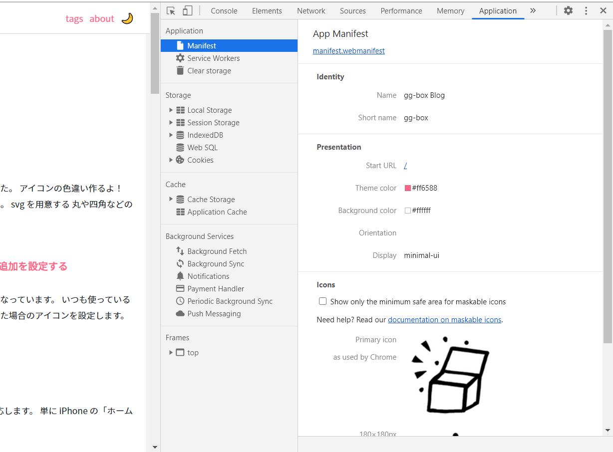
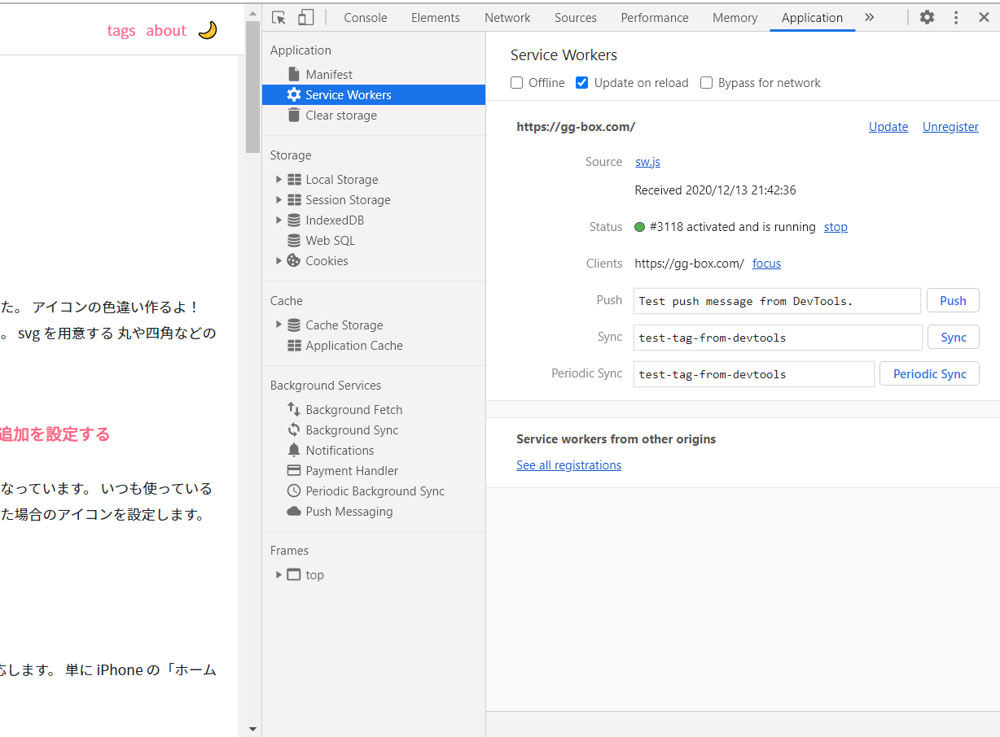

## PWA ッテナンダ？

PWA : Progressive Web Apps （プログレッシブ ウェブアップス）のことで、
モバイルのブラウジングとか、UI 関係に関する体験（UX）を向上しようといく取り組みであり、プロジェクトであり、技術を指します。

モバイルだけの話ではなく普通に PC でも普及し初めています。

PWA は AppleStore とか Google Play Store からインストールするものではなく、いわゆるぎきゅつに対する名前になります。

PWA を盛り込んだウェブサイトは、ブラウザがいろんなことを担当し

- ホーム画面にアイコンを表示する
- トップレベルの全画面表示で読みこめる
- 不安定なネットワークでも迅起動する
- プッシュ通知を送信する

などが出来ます。オフラインでもできることは多いです。たぶんこれからも出来ることは増えていく感じ。

ちなみにブラウザ毎に実装が異なる場合があるので注意しましょう。

[Add a web app manifest](https://web.dev/add-manifest/)

## PWA の技術要件

以下 3 つが必須になります。

- HTTPS サイトである
- Service Worker を使っている
- マニフェストファイル(manifest.json)を配置している

## 勘違いしやすいところ

違う！→ Service Worker を使っているから PWA

違う → マニフェストファイル を使っているから PWA

一応今はこう考えてますが、概念の話なので将来的には変化するんだろうなあと思います。

## Gatsby's blog starter を使しているこのサイトは PWA です

HTTPS を使用しており、 Service Worker を使っていて、manifest.json も設定している
当ブログは 2020/12 現在 PWA 対応サイトということになります。

## GoogleChrome 検証画面から PWA を眺めてみる

Chrome の検証画面でマニフェストファイル(manifest.json)と Service Worker がどういう風に設定されているのか見てみます。

### マニフェストファイル(manifest.json)

### Service Worker

## 参考

- [Web Workers API](https://developer.mozilla.org/ja/docs/Web/API/Web_Workers_API)
- [Web app manifest does not meet the installability requirements](https://web.dev/installable-manifest/)
- [How to provide your own in-app install experience](https://web.dev/customize-install/)
- [Service Worker](https://qiita.com/propella/items/6500f76c9c1521878a6b)
- [Windows のプログレッシブ Web アプリ](https://docs.microsoft.com/ja-jp/microsoft-edge/progressive-web-apps-chromium/)
- [PWA におけるキャッシュの更新方法](https://blog.htmlhifive.com/2018/08/27/pwa-cache-update/)
- [create-react-app でさらにサービスワーカー機能を追加](https://stackoverrun.com/ja/q/13044832)
- [PWA に対応したはずなのに「このサイトをホームに追加」バナーが表示されないときの対処法](https://qiita.com/gyuta/items/9e9cfd84dc3e3cc37810)

- [PWA 入門 〜iOS Safari で PWA を体験するまで〜 2019 年 7 月更新](https://qiita.com/umamichi/items/0e2b4b1c578e7335ba20)
- [iOS の 11.3 からの PWA 対応でできるようになったこと](https://takeshiamano.medium.com/ios%E3%81%AE11-3%E3%81%8B%E3%82%89%E3%81%AEpwa%E5%AF%BE%E5%BF%9C%E3%81%A7%E3%81%A7%E3%81%8D%E3%82%8B%E3%82%88%E3%81%86%E3%81%AB%E3%81%AA%E3%81%A3%E3%81%9F%E3%81%93%E3%81%A8-313f638a172b)
- [PWA の基礎知識（その 5）「Web App Manifest の使い方」](https://blog.htmlhifive.com/2018/07/12/pwa-web-app-manifest-how-to-use/)
