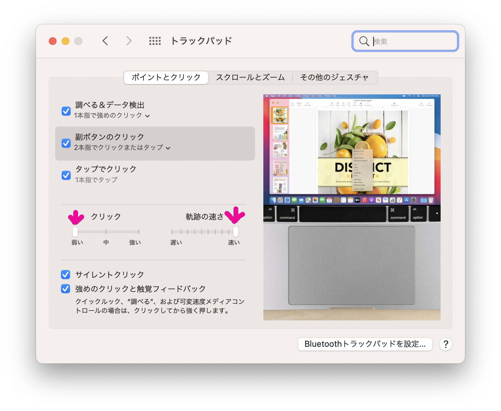
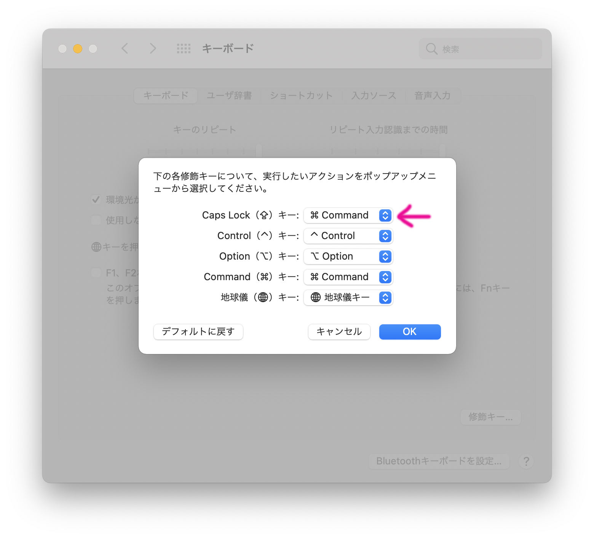
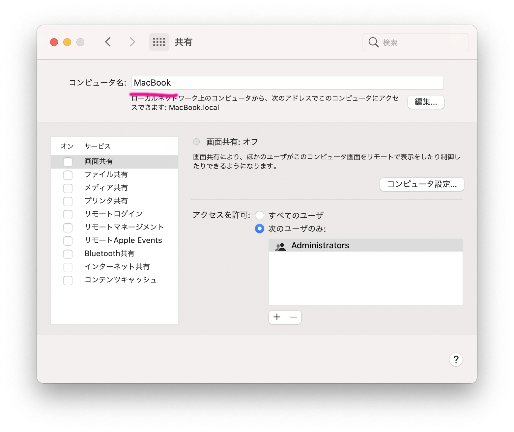
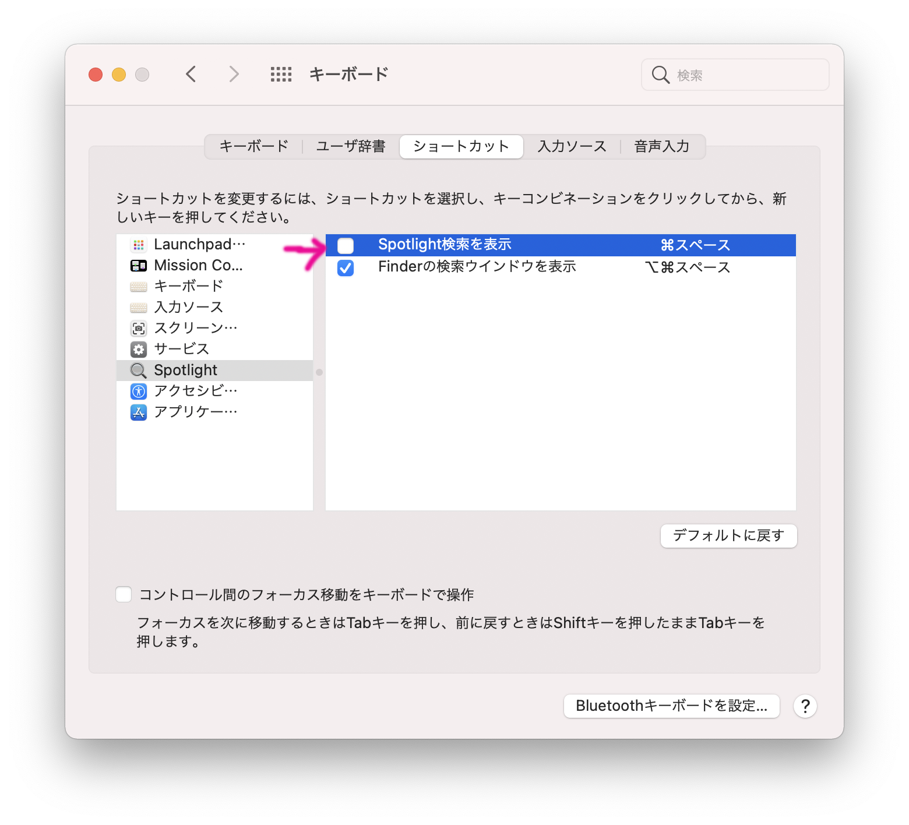
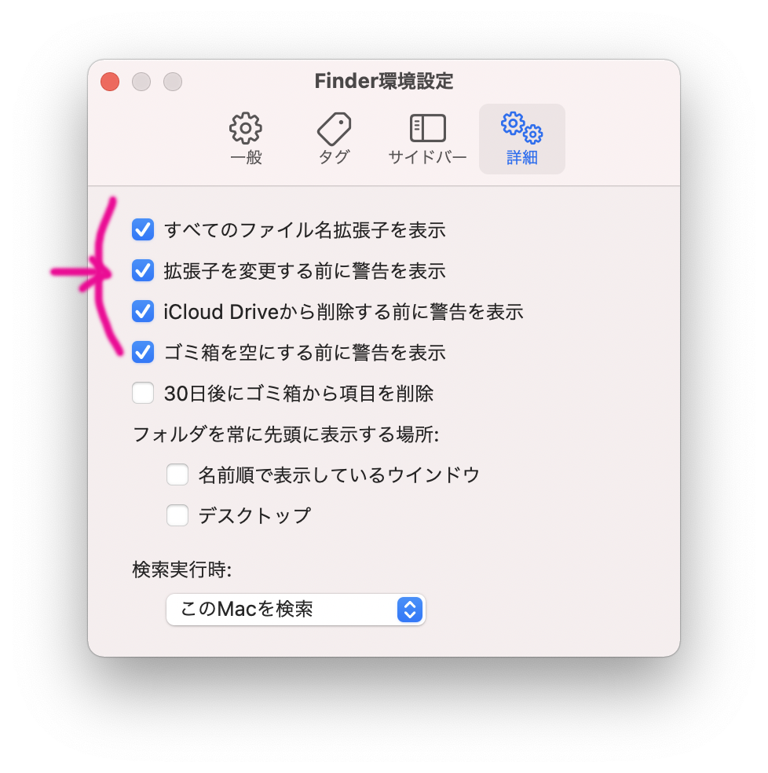

このたびめでたく（ようやく）MacbookAirを購入したので、セットアップした作業内容をメモしておくことにします。
全部私の好みなので、適当に読み替えていただくとよいと思います。

ざっくりこのような順番でまとめています。

- システム環境設定とユーティリティ編 ← いまここ
- [Homebrew編](https://gg-box.com/2021_07/2021_07_12_macbook_setup_homebrew/)
- [ターミナル編](https://gg-box.com/2021_07/2021_07_18_macbook_setup_tarminal/)
- [開発環境編](https://gg-box.com/2021_07/2021_07_20_macbook_setup_dev/)

## システム環境設定

### Dockの設定

- システム環境設定 > Dockとメニューバー
    - サイズ調整
    - あとは使わないものを省く


### マウスカーソルの軌跡

- システム環境設定 > トラックパッド
    - 軌跡の速さ を最速にする
    - クリック を弱いにする



### キーのリピート、入力認識までの時間

- システム環境設定 > キーボード
    - キーのリピート・リピート入力認識までの時間 を最速にする


### スクロールの速さ

- システム環境設定 > アクセシビリティ > トラックパッドオプション
    - スクロールの速さ を最速にする


### Caps LockキーをCommand（⌘）キーに設定

- システム環境設定 > キーボード > 装飾キー
    - Caps LockキーをCommand（⌘）キーに変更



### ログイン画面の画像を変更

- システム環境設定 > ユーザとグループ
    - 画像にカーソルを合わせると編集できる 


### ディスプレイの拡大設定

- システム環境設定 > 内蔵Retinaディスプレイ
    - デフォルトを「スペースを拡大」にすると、作業領域が広がる/文字が小さくなる


### PCの名前を変更

- システム環境設定 > 共有 で「コンピュータ名」を任意の名前に変更
    - ここでは「MacBook」に変更
    - プロンプトの表示も変わるので注意



### セキュリティ設定

セキュリティがなんにもないので、一応以下の2つを入れる

- ディスクの暗号化（FileVault）
- ファイアーウォールの有効化

設定の変更は左下の南京錠をクリックして変更します。

#### ディスクの暗号化（FileVault）

Macbook紛失時などの対策のため、ディスクを暗号化します。
システム環境設定 > セキュリティとプライバシー
- FileVault でFileVaultをオン


#### ファイアーウォールの有効化

システム環境設定 > セキュリティとプライバシー > 
- ファイアーウォール でファイアーウォールをオン


### Spotlightの無効化

Spotlightはランチャーアプリです。あとで別のAlfredを入れるので、無効にしておきます。

システム環境設定 > キーボード > ショートカット > Spotlight 
- 「Spotlightを表示」のチェックを外す



#### finderの設定

#### サイドバー
finderにはできるだけ多く表示されていてほしいので、サイドバーの表示項目はすべてチェックします。


#### 拡張子を表示

finder > 環境設定 > 詳細
- 「すべてのファイル名拡張子を表示」にチェックを入れる



#### パスバーを表示

finder > 表示 の「パスバーを表示」を有効にします。
有効にするとfinderの下部にパスが表示されます。


#### 隠しファイルを表示

finderを開いて、Command（⌘） + shift(⇧) + ドット(.)を入力する。
上記コマンドを入力するごとに「隠しファイル表示/非表示」を切り替えられます。

### .DS_Storeファイル抑制
.DS_Storeファイルが生成されて鬱陶しいので生成されないようにします。

```bash
#ネットワークドライブ上への.DS_Storeファイルの作成抑制
defaults write com.apple.desktopservices DSDontWriteNetworkStores true

#USB上への.DS_Storeファイルの作成抑制
defaults write com.apple.desktopservices DSDontWriteUSBStores -bool true
```


### スクリーンショットのファイル名変更

スクリーンショットのファイル名を任意のものに変更します。(今回は、「Screenshot」にします)
defaults write com.apple.screencapture name Screenshot


### キーボードカスタマイズ

他で持っているWindowsキーボードを使いたいので、割当ができるkarabiner-elementsを入れます。

[karabiner-elements](https://karabiner-elements.pqrs.org/)

### スクロールの上下動作をパッドとマウスで分ける

MagicTrackpad2とマウスを併用するので、上下のスクロール方向をそれぞれのデバイスで分けたいのでScroll Reverserを入れます。

[Scroll Reverser](https://pilotmoon.com/scrollreverser/)