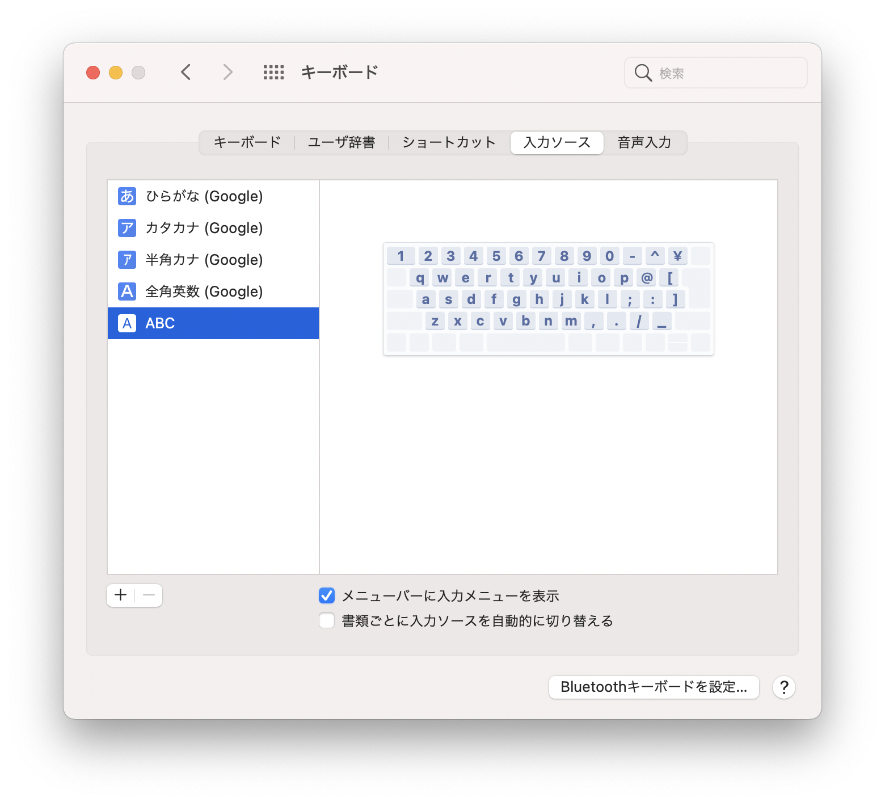

初期セットアップリンク
- [システム環境設定とユーティリティ編](https://gg-box.com/2021_07/2021_07_11_macbook_setup_init/)
- Homebrew編 ← いまここ
- [ターミナル編](https://gg-box.com/2021_07/2021_07_18_macbook_setup_tarminal/)
- [開発環境編](https://gg-box.com/2021_07/2021_07_20_macbook_setup_dev/)

## Homebrew

Homebre 本体のインストールはこちらから。

[Homebrew macOS（またはLinux）用パッケージマネージャー](https://brew.sh/index_ja)


インストールコマンド

```console
/bin/bash -c "$(curl -fsSL https://raw.githubusercontent.com/Homebrew/install/HEAD/install.sh)"
```


Homebrewで入れたものの一覧がこちら。とりあえず、使うとわかっているものだけ厳選しています。

nodebrewについては、後述する開発環境の話につながります（Nodeを使わないなら関係ないです）。

ちなみにこの記事を書いている現在、caskはbrewに包括されていますので、caskを別にインストールする必要はありません。

コマンドも`--cask`を末尾につけるように変更になっているので、brew公式サイトを引用する場合は読み替えてください。

```console
# ショートカット
brew install alfred

# Google日本語
brew install google-japanese-ime --cask

# ブラウザ
brew install google-chrome --cask
brew install firefox --cask

# ターミナル
brew install iterm2 -- cask

# テキストエディタ
brew install sublime-text

# 入力で外部キーボードとマウスを使用するときに使うもの
brew install scroll-reverser -- cask
brew install karabiner-elements --cask

# 開発環境用
brew install git
brew install nodebrew
```


### Google日本語入力を使えるように設定

Google日本語(google-japanese-ime)を入れたら忘れずに設定する。

- システム環境設定 > キーボード > 入力ソース
    - 左ペインの「＋」から、Google日本語を追加し、デフォルトの日本語を「ー」で消しておく

 
