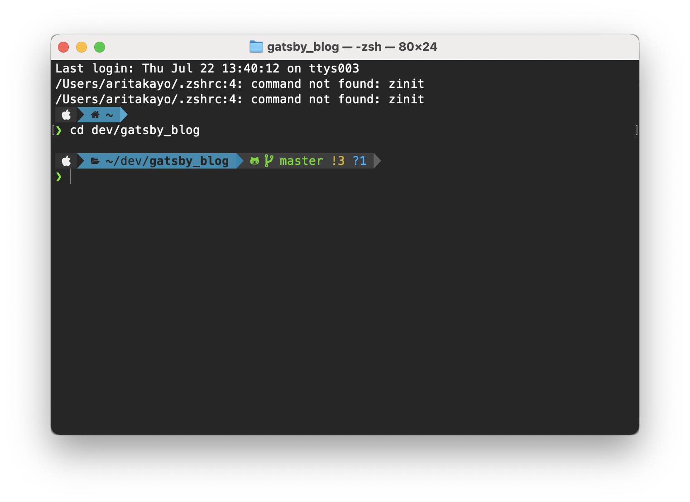
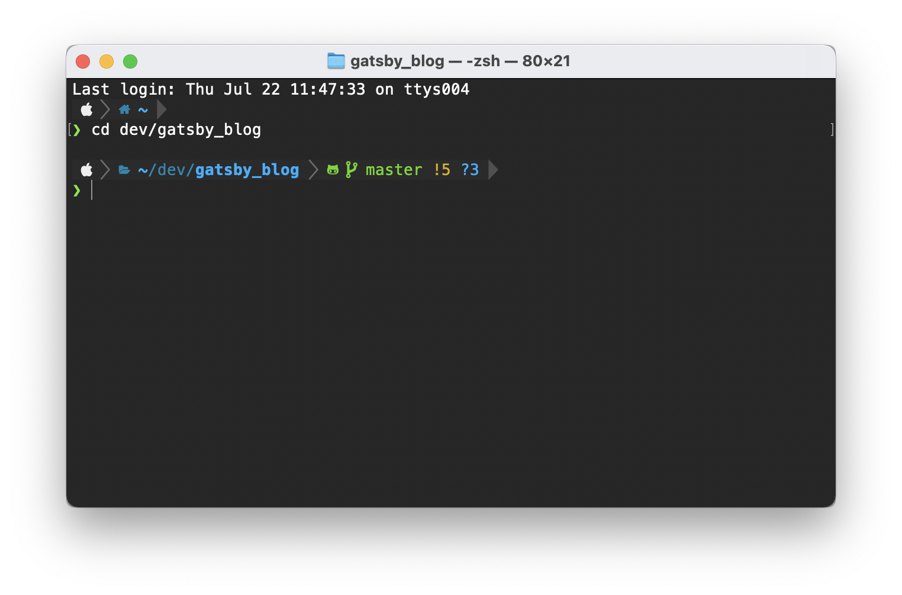

初期セットアップリンク
- [システム環境設定とユーティリティ編](https://gg-box.com/2021_07/2021_07_11_macbook_setup_init/)
- [Homebrew編](https://gg-box.com/2021_07/2021_07_12_macbook_setup_homebrew/)
- ターミナル編 ← いまここ
- [開発環境編](https://gg-box.com/2021_07/2021_07_20_macbook_setup_dev/)

ターミナルはかわいくしておくに越したことはないので、今回は見た目重視のカスタマイズをします。（本当に見た目の話だけ）

Oh My Zshでもzinitでもプラグインマネージャーについては言及しません。
一旦ここではzinitを入れてから、Powerlevel10kでねりねりします。

## 最終的にこうなった

gitがとても豚さんに見えるよ。



## インストール

### フォントのインストール

後述のPowerlevel10kで使う、[Meslo Nerd Font](https://github.com/romkatv/powerlevel10k#fonts)を入れます。
その後、ターミナルのフォントをMesloLGS NFに変更します。絵文字が出るので楽しいです。

### zinitのインストール

任意で。とても早いらしいが、私はあまり速度を気にするほどターミナルを使わないのでなんとなく入れてみたくらいの気持ちです。
[zinitのインストール方法](https://github.com/zdharma/zinit#installation)はこちら。

### Powerlevel10kのインストール

[Powerlevel10k](https://github.com/romkatv/powerlevel10k)

インストール方法は、ベースによっていろいろあるのでどれか選んで入れてください。
Homebrewから入れる方法もあります。これが一番手っ取り早いのかも。

### Powerlevel10kをねりねりする

インストール後にターミナル立ち上げると、Powerlevel10kの対話型の設定ウィザードが始まります。
失敗してもいくらでもやり直せるので、適当にぽちぽち選んだら良いと思います。

あとでカスタマイズしたいなら、ベースになりそうな近いものを作成すると早いです。

最初のウィザードを終了しただけでこのかわいさ




このあと、少しだけ色を変更したいので、~/.p10k.zsh（Powerlevel10kの設定ファイル）の色コードのみ少し変更しました。

 - りんご部分
```console
# OS identifier color.
typeset -g POWERLEVEL9K_OS_ICON_FOREGROUND=255
typeset -g POWERLEVEL9K_OS_ICON_BACKGROUND=235
```

 - ディレクトリ部分（途中省略部分あり）
```console
# Current directory background color.
typeset -g POWERLEVEL9K_DIR_BACKGROUND=31
# Default current directory foreground color.
typeset -g POWERLEVEL9K_DIR_FOREGROUND=235
# Color of the shortened directory segments.
typeset -g POWERLEVEL9K_DIR_SHORTENED_FOREGROUND=103
# Color of the anchor directory segments. Anchor segments are never shortened. The first
# segment is always an anchor.
typeset -g POWERLEVEL9K_DIR_ANCHOR_FOREGROUND=235
```

 - git部分
```console
typeset -g POWERLEVEL9K_VCS_BACKGROUND=236
```

これでいい感じになったので満足。

## 参考

 - [ターミナルをいい感じにして楽しむ](https://qiita.com/szk07/items/b15c38ec73e547a23439)
